# Spotify Clone

This is an SPA that aims to clone the spotify application and allow the user to search for music, create playlists and save them to their authenticated spotify account. The user can create, manage and add songs to local playlists, listen to a preview version of the songs and upload their new playlists to spotify.
  
[Visit the application](https://spotify-app-8rdu.onrender.com)

## Table of Contents

- [Features](#Features)

- [Installation](#installation)

- [Development](#development)

- [Usage](#usage)

- [Instructional-GIF](#Instructional-GIF)

- [Video-Describing-Functionality](#Video-Describing-Functionality)

- [License](#License)

- [Badges](#Badges)

  

## Features

1. The login and signup pages use BCrypt to authenticate and protect the users passwords in the backend. The signup page requires several information fields to be entered including birthdate, email and an avatar url.

2. The Home page displays all the songs from the list of recommended playlists from spotify. This list changes daily and the playlist could be refreshed from the home page. Each song in the playlist is displayed as a tile and will play when the user hovers over it. Clicking on the tile will add the song to the user selected playlist from the drop down menu. Each tile displays a popover with more information about the song. 

3. The Search page allows searching for albums, artists, playlists and songs from a single search term. Ten Results are displayed for each search category. The song results are displayed with buttons that allow playing each song and adding each song to a particular playlist.

4. The playlist page displays the playlist information for each playlist owned by the user. Each playlist can be deleted, updated and read. A simple link in the navigation bar is provided for creating a playlist. Each page lists the songs that belong to that playlist and a convenient search bar at the bottom allows searching for new songs. All songs can be played from this page and when played, the playlist is queued in the song list. Clicking on repeat in the play bar at the bottom of the page will play all songs in the playlist on a loop. The songs are played from spotify and not provided in full so they are limited to 30 second clips.

5. A user is able to login with their spotify account through a convenient link. The users address must be added to the developer app registry before hand. The playlists created in this SPA can then be added to the users spotify account and played from the spotity website when logged into their account. 

6. The users profile is available in the upper right hand corner. The specifics about the user can be updated from the profile page.

7. The Library page displays links that render the users songs, playlists, artists or albums in more detail.

## Installation

After cloning this repository, you will need to install the frontend dependencies and the backend gems. Some configuration will be required to get the database to work, to provide credentials from the spotify to use their API and to host this app.
##### General Setup
Open in the editor and navigate to the client directory and run the command for installing the nodes using the following.
```js
$ npm install 
```
It is built with the React framework and must be initialized by running the following command.
```js
$ npm start
```
In a new terminal window at the root of the app, run the following command to install the gems required.
```rb
$ bundle install
```
Then run the following to start the server.
```rb
rails s
```
##### Database configuration
In order to change the database configuration to work with your preferred database, open the ```config/database.yml``` file and find the following entries, change the adapter to your preferred relational database management system, then change the name of the database to the name of yours.
```rb
default: &default
  adapter: postgresql <-- change to your preferred system -->
  encoding: unicode
  pool: <%= ENV.fetch("RAILS_MAX_THREADS") { 5 } %>
```
Find the environment database declaration and change the name to your database name.
```rb
  test:
  <<: *default
  database: spotify_app_test <-- change to the name of your database -->
  
  development:
  <<: *default
  database: spotify_app_development <-- change to the name of your database -->
```
If you will be hosting this app, then you will need to provide the database url of your hosted database instance from your hosting service.
```rb
production:
  <<: *default
  url: <%= ENV['DATABASE_URL'] %> <-- This URL reads from render, change to satisfy your hosting service's requirements -->
```
##### Spotify developer credentials
This app uses the API from Spotify through the RSpotify gem and requires a registered applications' credentials to be used for authorizing API calls to spotify and authenticating a spotify user to access their account from this application.
Use the following link to visit [Spotify](https://developer.spotify.com/documentation/web-api/quick-start/) for the steps to register this app and obtain your ```client_id``` and ```client_secret```.
Then run the following command to open your credential editor.
```rb
$ EDITOR="code --wait" bin/rails credentials:edit
```
Then paste your information from spotify inside the credentials file in the following format.
```rb
spotify:
  client_id: <-- client_id here -->
  client_secret: <-- client secret here -->
```
Be sure to close the file and verify you recieved the following message.
```
$ File encrypted and saved.
```
Remember to follow your hosting services guidelines to host this app!

Enjoy!

Clone the repo [from Github here](https://github.com/Bambam320/spotify-app)

## Development

***Home Page***
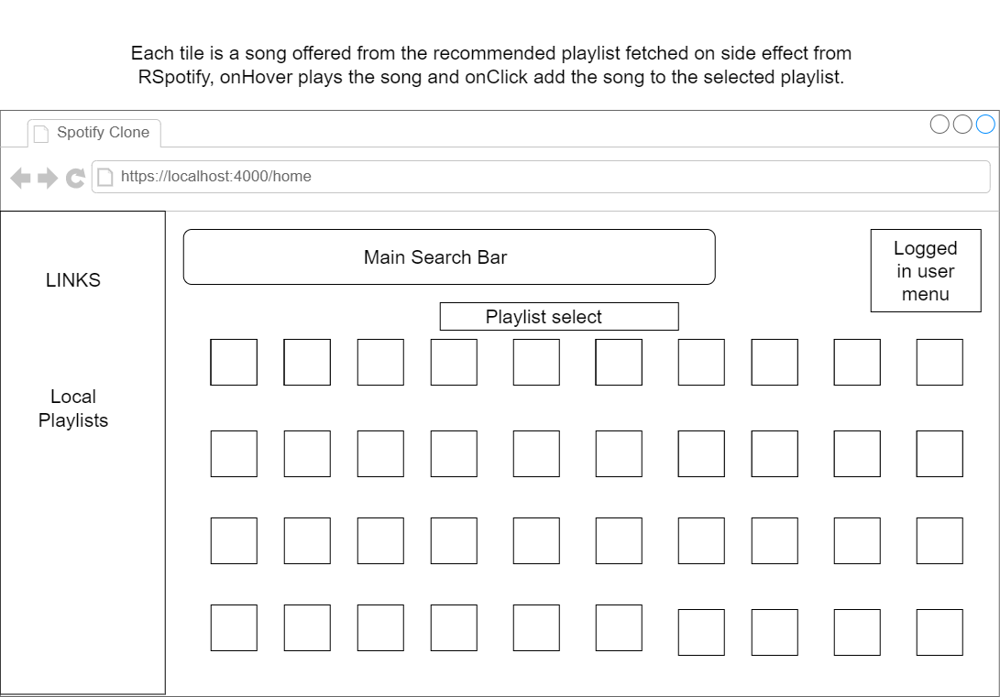

***Search Page***
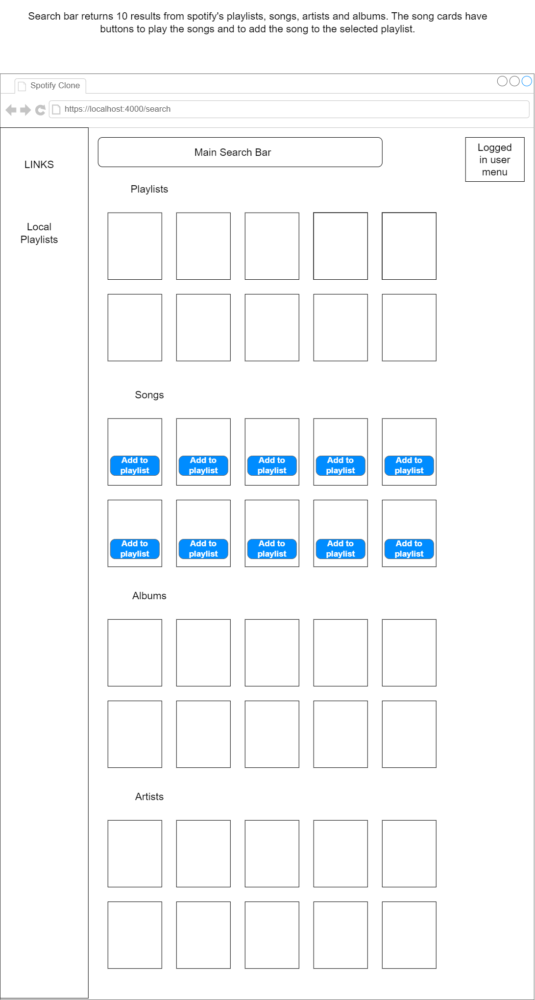

***Profile Page***
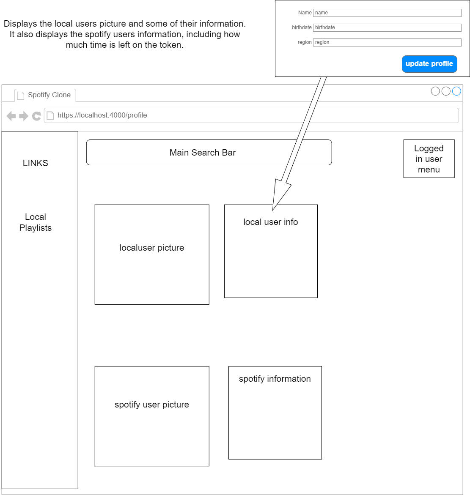

***My Playlist Page***
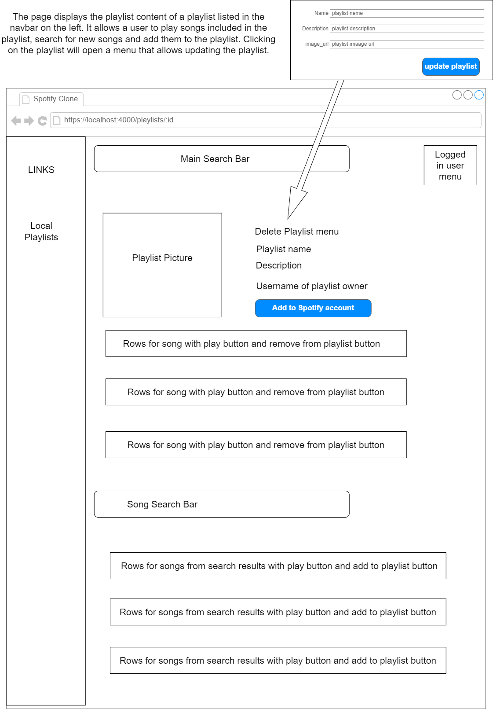

***Audio Player Page***
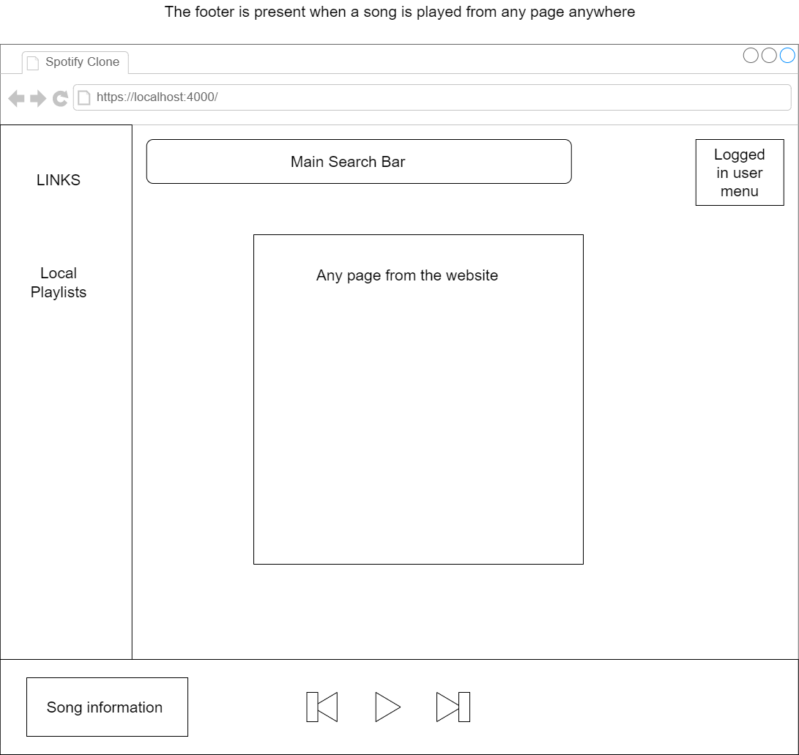

***Local Users Artists, Songs, Playlists, Albums Page***\
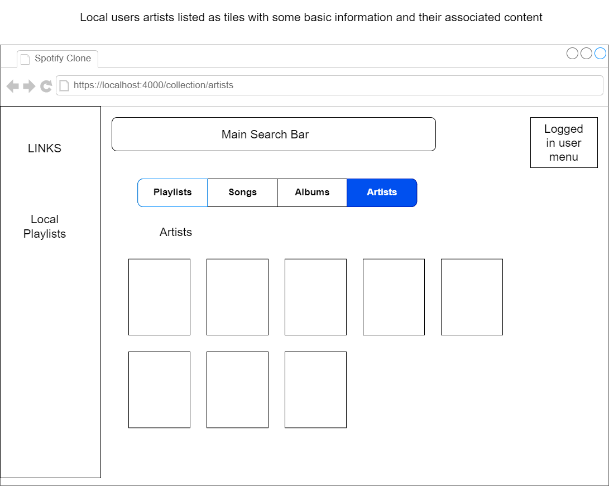
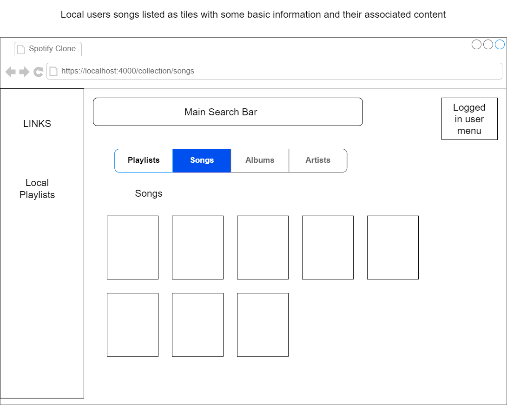
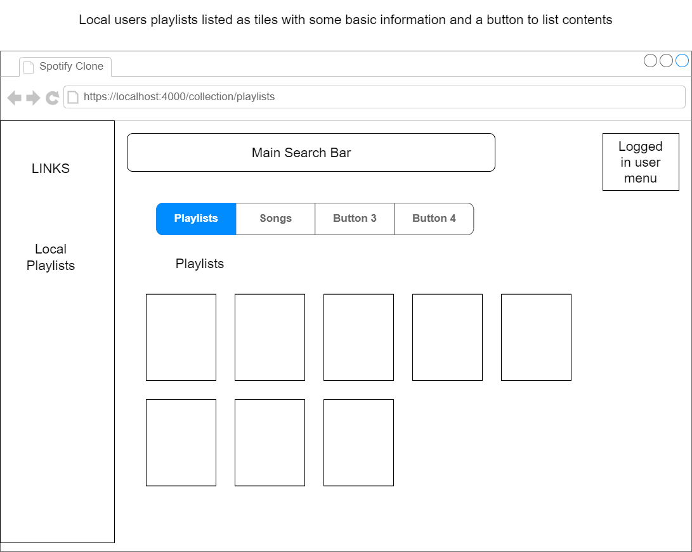
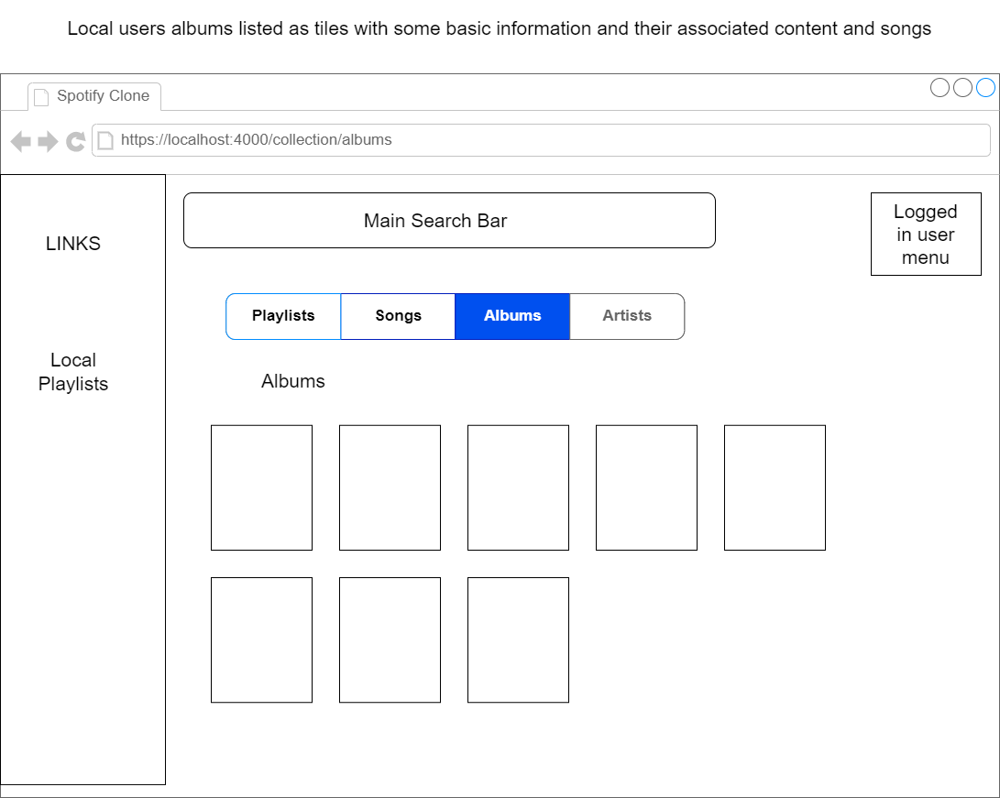

## Usage

The SPA's functions are described below with imagery and code to best demonstrate their use.

***SPA Component Tree***

The component tree includes an index file that attaches the react app to the DOM. Then the ```<App>``` component provides context and routing for all of the children elements. The ```<Helmetcode>``` component provides the favicon and description for the tab in the browser. The first component that the user sees is the ```<Login>``` component, which provides the login and signup page. The three main structural components are the ```<NavBar>, <Header> and <Footer>``` components. The ```<Navbar>``` component provides the links for all the components in the app, and it provides a list of all of the users playlists. The ```<Header>``` component provides a menu for the user to view their profile or logout and a main search bar. The ```<Footer>``` component is essentially a player which provides the song information as well as play, pause, skip, previous, shuffle and replay buttons. 

The ```<Home>``` component provides all the songs from the featured playlists from spotify. Each playlist comes from spotify and each song is provided as a tile. The song can be played by hovering over it or added to the selected playlist by clicking on it. The ```<Home>``` component renders a ```<HomeSong>``` component for each song. The ```<Search>``` component uses the search term from the main search bar in the ```<Header>``` component and lists a limit of 10 results for artists, albums, songs and playlists. The songs in the results render a ```<SongResultPlaylistForm>``` which allows selection of a playlist and a button to add the song to a playlist. The ```<Playlist>``` component renders when a specific playlist is clicked from the ```<Navbar>``` component. The ```<PlaylistInfo>``` component renders the information about the playlist, and clicking on any portion of the playlists information, renders the ```<PlaylistInfoDialog>``` component which opens a dialog that allows updating the information of the playlist. The ```<PlaylistSongRow>``` component renders the songs that belong to that playlist and allow the user to play the song or remove it from the playlist. The ```<SongRow>``` component lists the songs returned from the search bar that is available just below the playlists songs. It allows a user to play the song or add it to the playlist.

The ```<Profile>``` component provides information about the logged in user and the users authorized spotify account information. The ```<Collection>``` component renders links through the ```<CollectionLinks>``` component for displaying the users playlists, songs, artists and albums per playlist. The ```<CollectionPlaylists>``` display each playlist as a tile. The ```<CollectionSongs>``` renders each playlist and for each playlist it renders ```<CollectionSongEachSong>``` which displays each song for each playlist. The ```<CollectionAlbums>``` and ```<CollectionArtists>``` respectively render ```<CollectionAlbumsEachAlbum>``` and ```<CollectionArtistsEachArtist>``` displaying albums and artists for each playlist.

```
Index from the src folder
└── App 
  ├── Helmetcode
  ├── Login
  ├── Navbar
  ├── Header
  ├── Home
  |   └── HomeSong
  ├── Search
  |   └── SongResultPlaylistForm
  ├── Playlist 
  |   └── PlaylistInfo
  |       └── PlaylistInfoDialog
  |   └── PlaylistSongRow
  |   └── SongRow 
  ├── Profile 
  ├── Collection
  |   └── CollectionLinks
  ├── CollectionPlaylists
  ├── CollectionSongs
  |   └── CollectionSongEachSong
  ├── CollectionAlbums
  |   └── CollectionAlbumsEachAlbum
  ├── CollectionArtists
  |   └── CollectionArtistsEachArtist
  └── Footer
```
***Entity Relationship Model***

The User has many playlists and each of those playlists has many songs. Each song also belongs to an album and an artist. The artist also has many albums.

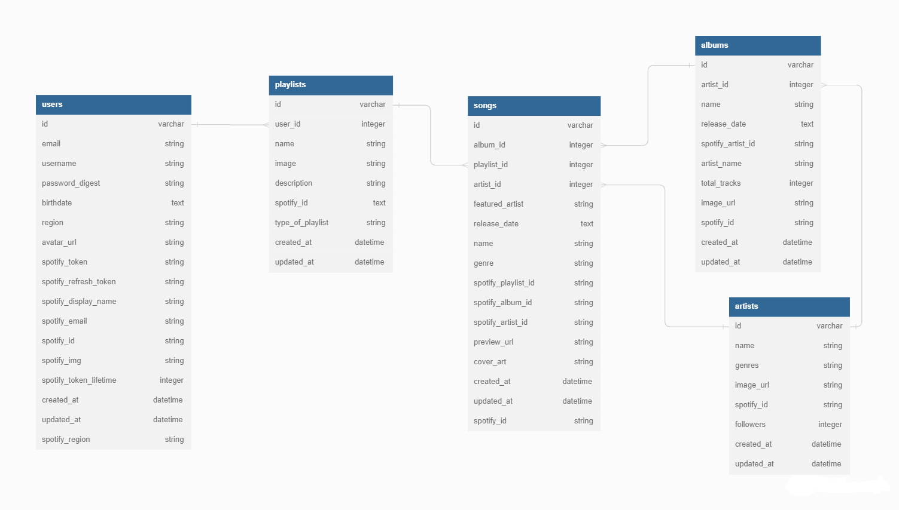

***Login and Sign Up Pages***

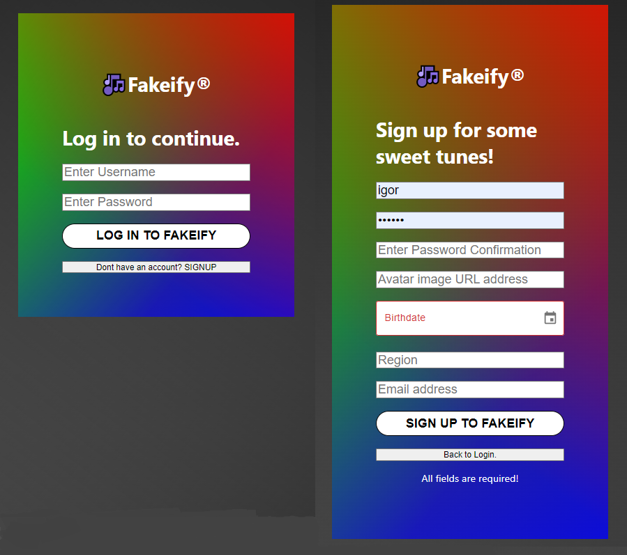

The Login and SignUp page are provided when no user is logged in and provide fields to create a new user or login. Their is an autologin function that automatically reads whether or not a user has signed in previously and logs them in.
```
  ├── Login
```

The ```<Login>``` component provides a form for a user to login through or a signup form that allows entry of a username, password and confirmation, avatar image address, birthdate, region and email address. The fields in the signup page are required, especially for the email address. This email address is used in order to be white-listed with spotify so that a user can login with their spotify account. That is used to save playlists created in this app to the users spotify account.
The backend provides actions to create and delete a user, as well as logging a user in, manually and automatically. All users are returned with their associated playlists, the playlists associated songs and the songs associated artists and albums.

```rb
  # finds a user and authenticates them then returns the user with 201 status code
  # sessions#login
  def create
    this_user = User.find_by!(username: user_params[:username])
    if this_user&.authenticate(user_params[:password])
      session[:user_id] = this_user.id
      user = clear_spotify_information(this_user)
      render json: user, include: ['playlists', 'playlists.songs', 'playlists.songs.artist', 'playlists.songs.album'], status: 201
    else
      render json: { errors: ["Username or Password is incorrect"] }, status: :unprocessable_entity
    end
  end
```
The "signup" portion of the login component utilizes the date/time picker from "Momentjs" which allows the user to choose their birthdate using a calendar. It utilizes the ```AdapterMoment``` package which provides the data to the ```<DesktopDatePicker>``` tag in the form of a moment object. That date is stored in state as a string in the key, ```form.birthdate``` and then converted back to a moment for use in the value prop of the tag.
```js
  <LocalizationProvider dateAdapter={AdapterMoment}>
  <DesktopDatePicker
    label="Birthdate"
    inputFormat="MM/DD/YYYY"
    name='birthdate'
    value={moment(form.birthdate)}
    onChange={(e) => handleTimeChange(e)}
    inputProps={{
      style: {
        height: "0",
        fontSize: '19px',
        alignItems: 'center',
        paddingTop: '20px',
      },
    }}
    renderInput={(params) => <TextField
      {...params}
      sx={{ backgroundColor: 'white', marginBottom: '25px', borderRadius: '4px', }}
    />}
  />
</LocalizationProvider>
```

***Home Page***

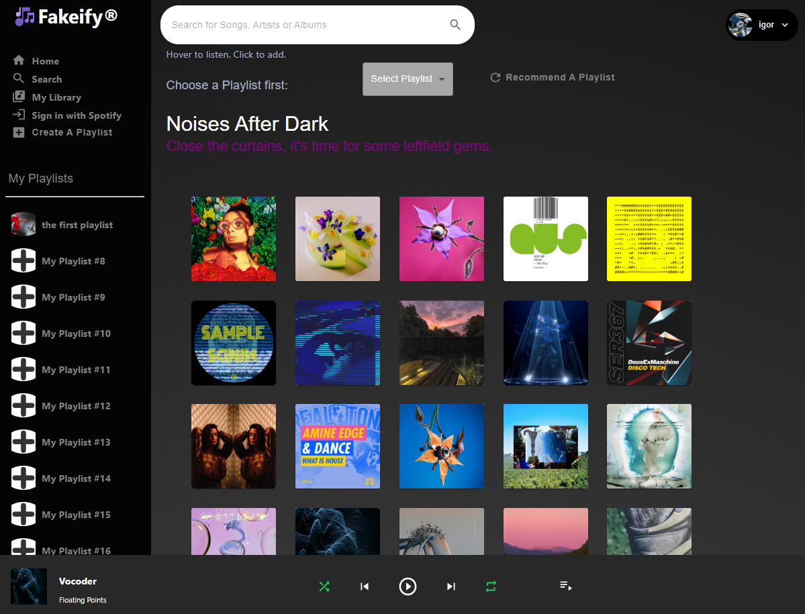

The Home page introduces the main components of the app, namely the Navbar, Header and Footer. The Navbar displays the links available in the app for the various pages. Below that it displays a link for each of the users playlists along with their image. The Header component provides an icon with the users name and avatar which opens a dropdown menu that provides a link to the users profile and a logout button which logs the user out of the application. The Footer component provides all of the information and functions for playing a song. The ```<Home>``` component provides a menu to select the playlist which the user wants to add a song to. Next to that is a buttom for requesting the next playlist from Spotify's featured playlists of the day. The title and the description of the playlist is displayed above the song tiles. Each tile represents a song from the playlist and allows a user to play the song when hovered over and to add a song to their playlist when clicked. Each tile displays a popover with additional information about the song.

```
  ├── Navbar
  ├── Header
  ├── Home
  |   └── HomeSong
  └── Footer
```
The ```<Header>``` component runs the ```checkSpotifyTimeRemaining``` function every minute to check whether or not the lifetime of the token provided by the Spotify API has expired. If it has, the spotify controller's action ```update_token``` will be fired. If the update was successful, the localuser will be updated with the updated token and lifetime keys updated to their new values.
```js
  // automatically checks if the token has expired and requests an updated token and new token_lifetime
  setTimeout(checkSpotifyTimeRemaining, 20000)
  function checkSpotifyTimeRemaining() {
    if (typeof (localUser.spotify_token_lifetime) === 'number') {
      let timeRemaining = Math.floor((localUser.spotify_token_lifetime - Date.now() / 1000) / 60)
      if (timeRemaining < 0) {
        fetch('/spotify_api/update_token')
          .then((res) => {
            if (res.ok) {
              res.json().then((user) => {
                setUpdateOpen(true)
                setLocalUser(user)
              })
            } else {
              setFailureOpen(true)
              setLocalUser({
                ...localUser,
                spotify_display_name: "",
                spotify_email: "",
                spotify_id: "",
                spotify_img: "",
                spotify_refresh_token: "",
                spotify_region: "",
                spotify_token: "",
                spotify_token_lifetime: ""
              });
            };
          });
      };
    };
  };
```
The ```update_token``` action will send a request to the Spotify API, it will include the credentials that allow this app to make requests, the refresh token which was provided from the previous sign up and the grant type so that the backend knows what type of data we are requesting. The response information will be used to update the user that made the request by saving the new information into the database. Then the user is returned back to the front end.
```rb
  # updates the token and associated info for the user
  def update_token
    @user = User.find(session[:user_id])
    body = {
      grant_type: "refresh_token",
      refresh_token: @user.spotify_refresh_token,
      client_id: Rails.application.credentials.spotify.client_id,
      client_secret: Rails.application.credentials.spotify.client_secret
    }
    spotify_response = RestClient.post('https://accounts.spotify.com/api/token', body)
    spotify_auth_params = JSON.parse(spotify_response)
    @user.update_columns(
      spotify_token: spotify_auth_params["access_token"],
      spotify_token_lifetime: @user.spotify_token_lifetime + spotify_auth_params["expires_in"]
    )
    render json: @user, include: ['playlists', 'playlists.songs', 'playlists.songs.artist', 'playlists.songs.album'], status: :ok
  end
```
The ```<Navbar>``` component provides a link to allow the user to login to spotify with this app. The link sends a request to ```/auth/spotify``` which is the oauth environment provided in the oauth dependency installed in this SPA. The environment makes the appropriate request to the Spotify API for authorization and the reply is directed to a callback function.

```js
  <a component='a' href="http://localhost:3000/auth/spotify" className='sidebarOption' onClick={() => { }}>
    <LoginIcon className="sidebarOption_icon" />
    <h4>Sign in with Spotify</h4>
  </a>
```
The reply is used to instantiate a new user in the RSpotify gem, then the local user model is updated with the appropriate information from spotify. This information is used to create requests that only an authorized user can make.
```rb
    # receives valid callback from spotify and saves the spotify users information into the local users record then redirects to the profile page in the front end
    def callback
      spotify_user = RSpotify::User.new(request.env['omniauth.auth'])
      current_user = User.find(session[:user_id])
      current_user.update_columns(
        spotify_token: spotify_user.credentials.token,
        spotify_refresh_token: spotify_user.credentials.refresh_token,
        spotify_token_lifetime: spotify_user.credentials.expires_at,
        spotify_display_name: spotify_user.display_name,
        spotify_email: spotify_user.email,
        spotify_id: spotify_user.id,
        spotify_img: spotify_user.images.length > 0 ? spotify_user.images[0].url : '',
        spotify_region: spotify_user.country,
      )
      redirect_to "http://localhost:4000/profile"
    end
```
The ```<Navbar>``` component provides a specific link that will create a new playlist and route that user to the new playlist. The ```currentPlaylist``` state will be updated with the new playlist as will the user held in state. The user will navigate to the playlist page using the id as a parameter. Then the ```<App>``` component will render the ```<Playlist>``` component with the appropriate paramters in the url.
```js
  // creates and sets a brand new playlist with default values and sets state with the new playlist
  function handleCreateAndRouteToPlaylist() {
    fetch('/playlists', {
      method: "POST",
      headers: {
        "Content-Type": "application/json",
      },
      body: JSON.stringify({ instructions: "Make a new playlist, bitch!" })
    }).then((response) => {
      if (response.ok) {
        response.json().then((newPlaylist) => {
          setCurrentPlaylist(newPlaylist)
          setLocalUser({ ...localUser, playlists: [...localUser.playlists, newPlaylist] })
          setTimeout(navigate(`/playlists/${newPlaylist.id}`), 1000)
        });
      } else {
        response.json().then((err) => setErrors(err.errors));
      }
    });
  };
```
The backend receives the request from a ```useEffect``` in the ```<Home>``` component. The ```requestRefresh``` is a boolean held in state which is set by the clicking of the "refresh" button. This allows the fetch to run on the first render and when the button is clicked.

```js
  //bring in featured songs from the spotify_api
  useEffect(() => {
    const retrieveRecommendedSongs = async () => {
      try {
        setLoader(true);
        const data = await axios
          .get(`/spotify_api/show_featured`)
          .then((res) => {
            setFeaturedSongs(res.data.songs);
            setPlaylistInfo(res.data.playlist_info)
          });
        setLoader(false);
        setErrors([])
      } catch (err) {
        setErrors(err.errors);
      }
    }
    retrieveRecommendedSongs()
  }, [requestRefresh])
```
The spotify controller in the backend receives this request with the ```featured_songs``` action. A counter is held in a session that is incremented based on which featured playlist is requested. It is set to ```0``` initially, so the first playlist is returned, then incremented by 1 for each successive request for playlists. After the last playlist is requested, the session counter is set to ```0``` so the playlists are looped over. The songs are provided in a hash as a key, along with the playlist name and description.

```rb
    # requests the featured playlist from spotify then chooses the next one in numerical succession
    # the playlist has its songs filtered for only the ones that include an audio preview_url
    # then it is sent back as a part of a hash including the basic playlist info
    def featured_songs
      session[:current_featured_playlist] = session[:current_featured_playlist] || 0
      featuredPlaylistLength = RSpotify::Playlist.browse_featured.length
      def return_songs playlist_index
        featuredPlaylist = RSpotify::Playlist.browse_featured[playlist_index]
        unfilteredSongs = featuredPlaylist.tracks
        songs = unfilteredSongs.filter { |song| !song.preview_url.nil? }
        playlist = Hash.new
        playlist[:songs] = songs
        playlist[:playlist_info] = {
          name: featuredPlaylist.name,
          description: featuredPlaylist.description,
        }
        return playlist
      end
      if session[:current_featured_playlist] == featuredPlaylistLength - 1
        playlist = return_songs(session[:current_featured_playlist])
        session[:current_featured_playlist] = 0
        render json: playlist, status: :ok
      elsif session[:current_featured_playlist] > 0 && 
        playlist = return_songs(session[:current_featured_playlist])
        session[:current_featured_playlist] = session[:current_featured_playlist] + 1
        render json: playlist, status: :ok
      elsif session[:current_featured_playlist] == 0
        playlist = return_songs(session[:current_featured_playlist])
        session[:current_featured_playlist] = session[:current_featured_playlist] + 1
        render json: playlist, status: :ok
      else
        render json: { errors: ["An error occured, please try again."] }, status: :not_found
      end
    end
```
The ```<HomeSong>``` component is rendered for each song provided in the featured playlist. The ```onAddSong``` and ```playSong``` functions are passed down to each song.
```js
  <Grid container spacing={4} width='1000px' sx={{ marginLeft: '35px', marginTop: '35px', marginBottom: '125px' }}>
    {featuredSongs.map((song) => {
      return (
        <HomeSong
          key={song.id}
          song={song}
          onAddSong={handleAddSongToPlaylist}
          playSong={sendToPlayer}
        />
      )
    })}
  </Grid>
```
When the pointer enters a song tile, a popover is opened to display extra information, the anchor is set as the song tile for the popover to open against and the song is sent to the player located in the ```<Footer>``` component.
```js
  <Card
    onClick={() => onAddSong(song)}
    onMouseEnter={(e) => {
      playSong(e, song)
      handlePopoverOpen(e)
      handleAnchorSongElementSelect(e)
    }}
    onMouseLeave={handlePopoverClose}
  >
```
The player function sets state for both the song that is meant to be played and the collection that the song belongs to. In this case, the song collection is all of the songs in the playlist. That state is sent to the Footer component which is listening for changes in this state to play the song.
```js
  //send the song and entire playlist to the player
  function sendToPlayer(e, track) {
    e.preventDefault()
    setCurrentQueue(featuredSongs)
    setCurrentTrack(track)
  };
```
The song tile can also be clicked which calls the ```handleAddSongToPlaylist``` function, shown below. It will send a post request to the songs controller with a specific object that details the information needed for all the attributes in the song model. If a song is added to the database successfully, the users playlists will be mapped over to find the playlist associated with the user that matches the playlist in which a song is being added, then the song will be added to the playlists songs and the user held in state will be updated with the new playlist.
```js
  // adds track to currentplaylist then updates state with the updated playlist from the backend
  function handleAddSongToPlaylist(track) {
    let songGenre = track.album.genres === null ? null : track.album.genres[0]
    fetch(`/songs`, {
      method: "POST",
      headers: {
        "Content-Type": "application/json",
      },
      body: JSON.stringify({
        spotify_id: track.id,
        spotify_album_id: track.album.id,
        playlist_id: selectedPlaylist.id,
        spotify_artist_id: track.artists[0].id,
        featured_artist: track.artists[0].name,
        release_date: track.album.release_date,
        name: track.name,
        genre: songGenre,
        preview_url: track.preview_url,
        cover_art: track.album.images[0].url,
      })
    }).then((res) => {
      if (res.ok) {
        res.json().then((newSong) => {
          let updatedPlaylists = localUser.playlists.map((pl) => {
            if (selectedPlaylist.id === pl.id) {
              pl.songs.push(newSong)
              return pl
            } else {
              return pl
            }
          })
          setLocalUser({ ...localUser, playlists: updatedPlaylists })
          snackbarInfo.current = track.name
          setSuccessOpen(true);
        });
      } else {
        res.json().then((err) => setErrors(err.error));
      };
    });
  };
```
The create action will be fired when a ```POST``` request is sent to ```/songs```. This action will find the playlist to which a song will be added, then create an artist and album with their respective spotify_id. The ```update_artist``` and ```update_album``` functions are held in the model files and update the meta data for the album and artist using the RSpotify gem. The id of the artist and album will then be added to ```updated_song_params``` which will be used to create a new song with it's associations properly created and then send the new song to the front end which will set state with it.
```rb
# POST /songs
def create
  playlist = Playlist.find(song_params[:playlist_id])
  artist = Artist.create!(spotify_id: song_params[:spotify_artist_id])
  artist.update_artist
  album = Album.create!(
    spotify_id: song_params[:spotify_album_id],
    artist_id: artist.id
  )
  album.update_album
  updated_song_params = song_params.clone
  updated_song_params["artist_id"] = artist.id
  updated_song_params["album_id"] = album.id
  song = playlist.songs.create!(updated_song_params)
  render json: song, status: :created
end
```
***Search Page***

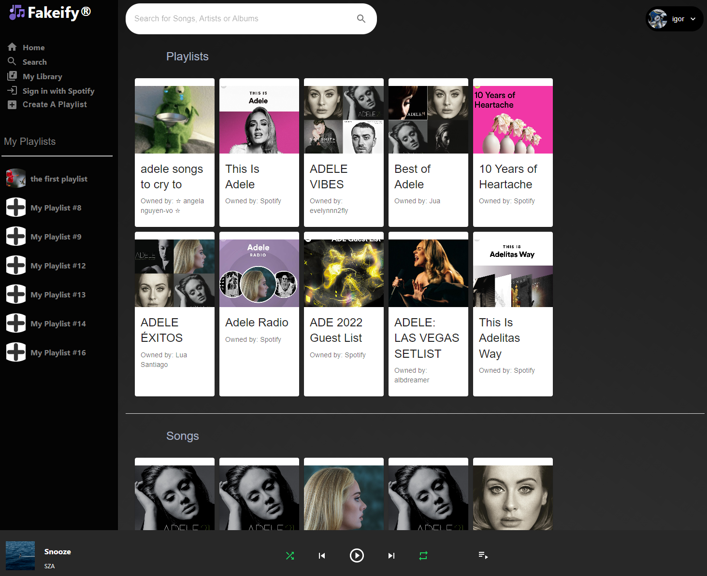

The Search page uses the information from the main search bar located in the ```<Header>``` component. The text entry by the user is sent to the ```spotify_api``` controller where it is used to send requests to the Spotify API and return 10 results per query. They are listed out as cards on the search page. The song cards have a menu which allows selecting a playlist which that song may be added to. 

```
  ├── Search
  |   └── SongResultPlaylistForm
```
The ```browse``` action is fired when the main search bar is queried with some kind of text. The RSpotify gem will be used to send the request to the API and return 10 results which are then sent back to the front end.

```rb
  # searches each category with the provided search term and returns, 10 each to the front end
  def browse
    results = {}
    results[:artists] = RSpotify::Artist.search("#{params[:term]}", limit: 10)
    results[:tracks] = RSpotify::Track.search("#{params[:term]}", limit: 10)
    results[:albums] = RSpotify::Album.search("#{params[:term]}", limit: 10)
    results[:playlists] = RSpotify::Playlist.search("#{params[:term]}", limit: 10)
    render json: results, status: :ok
  end
```
The Search component renders each of the 10 results as cards. The ```<SongResultPlaylistForm>``` component is rendered along with each song card. It uses the ```<Select>``` tag from Material UI and sets ```selectedPlaylist``` state with the value, which is also used to display the value in the input field. A user can then click the "add" button and similarly to the ```<Home>``` component, it will add a new song to the database with the proper associations.
```js
  <FormControl variant="outlined" style={{ minWidth: 150, marginLeft: '-15px' }} >
    <InputLabel id="playlist-select">Select Playlist</InputLabel>
    <Select
      labelId="playlist-select"
      id="playlist-select"
      value={selectedPlaylist.id}
      onChange={handleLocalPlaylistSelect}
      label="selectedPlaylist"
    >
      <MenuItem value={selectedPlaylist.id} onClick={(e) => handleLocalPlaylistDeselect(track, e)}> Select A Playlist </MenuItem>
      {localUser.playlists.map((playlist) => {
        let id = playlist.id
        return (
          <MenuItem key={id} value={id} >{`${playlist.name}`}</MenuItem>
        )
      })}
    </Select>
  </FormControl >
```

***Profile Page***

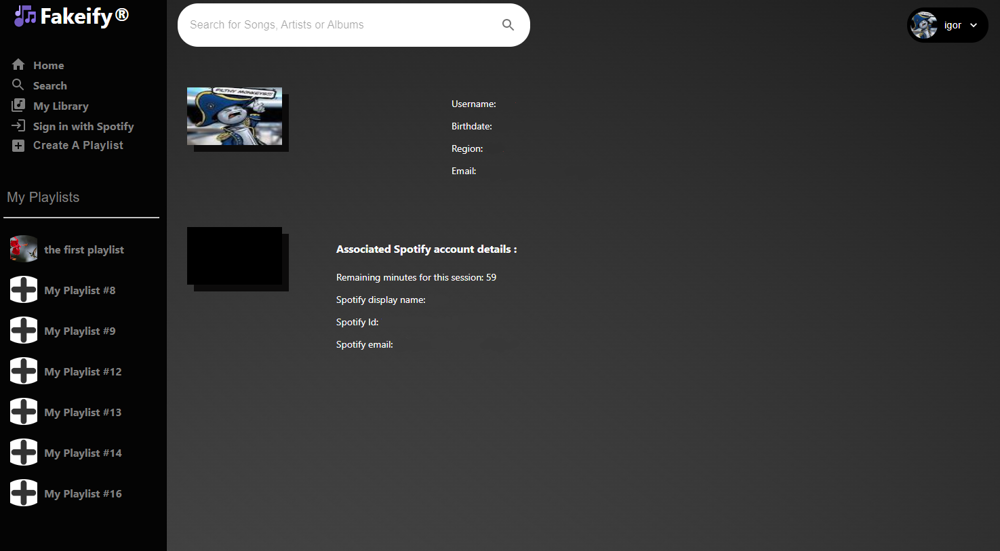

The Profile page displays the users information used to login and also the associated spotify users information, if they have logged with it.  
```
  ├── Profile 
```
The time provided in the ```localUser``` state is checked against the current time and then divided down into minutes so that the user can view how many minutes are remaining in their session. The state held ```TimeRemaining``` is updated with the current time or 0.
```js
  //renders 0 if the token has expired or actual time remaining if valid, every second
  setInterval(checkTimeRemaining, 1000);
  function checkTimeRemaining () {
    if (Math.floor((localUser.spotify_token_lifetime - Date.now()/1000)/60) < 0) {
      setTimeRemaining(0)
    } else {
      setTimeRemaining(Math.floor((localUser.spotify_token_lifetime - Date.now()/1000)/60))
    };
  };
```

***Collection Pages***

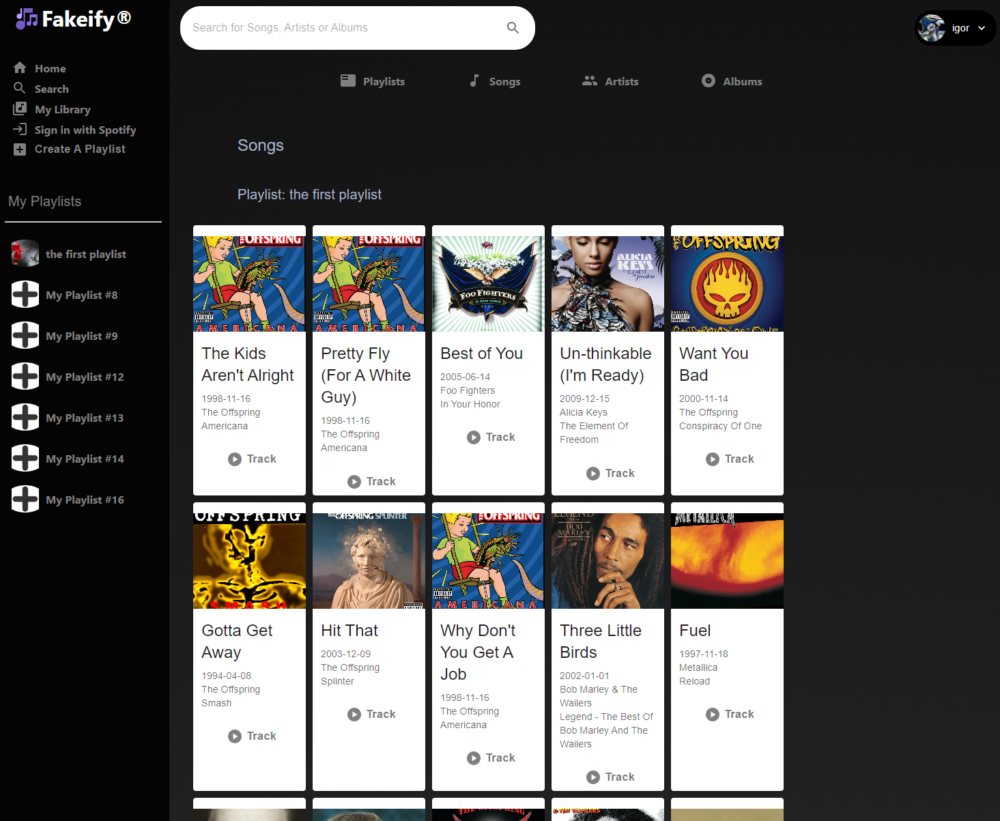

The ```<Collection>``` component renders the ```<CollectionLinks>``` component which provides a link for each model in this SPA. Each component excluding the```<CollectionPlaylists>``` component will behave similarly. The songs, albums and artists components will list the songs, or artists, or albums associated with each playlist. The ```<CollectionSongs>``` component will provide a card for each song with a play button that will play that song.

```
  ├── Collection
  |   └── CollectionLinks
  ├── CollectionPlaylists
  ├── CollectionSongs
  |   └── CollectionSongEachSong
  ├── CollectionAlbums
  |   └── CollectionAlbumsEachAlbum
  ├── CollectionArtists
  |   └── CollectionArtistsEachArtist
```
On a special note, albums and artists must be listed differently than songs because an artist or album can have many songs. In listing out albums, just as artists are listed, the duplicated must be removed. Below, the ```albums``` variable is created by taking each playlist that the user has and maps over it. The new array that is created contains elements that include the album name and the entire song itself. From that array, a new array is created with ```[...new Map```. The new array will only bring in elements that are not duplicates, since each element in the array must have a unique key. Then, the ```)).values()]``` method pulls only the ```song``` or the value of each element from the new array. Now, the last map, ```.map((song) =>)``` maps over each song and lists the contents. This new array does not contain any duplicates and will not list an album x amount of times for each song in the playlist that belongs to the album.
```js
  let albums = [...new Map(playlist.songs.map((song) => [song.album.name, song])).values()]
    .map((song) => {
      let album = song.album
      return (
        <Grid key={album.spotify_id} item component={Card} xs={2.2} sx={{ margin: '5px' }}>
          ...
        </Grid>
      )
    });
```

***Footer Page***


The ```<Footer>``` component is only displayed when there is a valid song provided to the player in this SPA. It provides an image, name and album for the song being played. It also provides a button for playing and pausing, as well as a next, previous, shuffle and repeat function. 
```
└── Footer
```
The audio used to play the songs is provided through a ```preview_url``` which is attached to most songs available from Spotify. The backend in this SPA filters out those songs which do not have a ```preview_url``` associated with it. Each ```preview_url``` is approximately 30 seconds long. The player uses a ```useRef``` hook called  ```audioElem``` which is referenced by the ref prop in the ```<audio>``` tag. When the hooks current value for play, pause, duration etc. is changed, it is made available to the ```<audio>``` tag through the reference prop. Setting the ```currentTrack``` state with a new song, prompts the ```<audio>``` tag to use a new url for the song. The buttons in the player are then available to act on the song being played, which can play or pause the song by setting the ref props current value to play or pause. Similarly, the duration value of the ```<audio>``` can be tracked and automatically play the next song in the queue when it finishes playing. 
```js
  const audioElem = useRef();

  <audio
    src={currentTrack.preview_url}
    ref={audioElem}
    onTimeUpdate={trackTime} 
  />

  //play or pause based on playstate
  useEffect(() => {
    if (playState) {
      audioElem.current.play();
    }
    else {
      audioElem.current.pause();
    }
  }, [playState, currentTrack]);

  // sets play reference to current track to false to end play and display play button
  function trackTime() {
    if (audioElem.current.duration === audioElem.current.currentTime) {
      setPlayState(false)
    }
    if (audioElem.current.duration === audioElem.current.currentTime && repeat) {
      nextSong()
    }
  };

  //autoplays a newly selected song
  useEffect(() => {
    currentTrack ? setPlayState(true) : setPlayState(false)
  }, [currentTrack]);

  //set next song in playlist
  function nextSong() {
    let currentSongIndex = currentQueue.findIndex((song) => song.id === currentTrack.id);
    let next = shuffle ? currentQueue[Math.floor(Math.random() * currentQueue.length)] : currentQueue.indexOf(currentTrack) === currentQueue.length - 1 ? currentQueue[0] : currentQueue[currentSongIndex + 1]
    setCurrentTrack(next)
  };
```

## Instructional-GIF

***Home Page***


***Search Page***


***My Library Collection***


***My Playlist Page***


## Video-Describing-Functionality

    
   [](https://youtu.be/OtEJsTMXXcs)


## License

MIT License
Copyright (c) 2022 Igor M.  

Permission is hereby granted, free of charge, to any person obtaining a copy of this software and associated documentation files (the "Software"), to deal in the Software without restriction, including without limitation the rights to use, copy, modify, merge, publish, distribute, sublicense, and/or sell copies of the Software, and to permit persons to whom the Software is furnished to do so, subject to the following conditions:  

The above copyright notice and this permission notice (including the next paragraph) shall be included in all copies or substantial portions of the Software.

THE SOFTWARE IS PROVIDED "AS IS", WITHOUT WARRANTY OF ANY KIND, EXPRESS OR IMPLIED, INCLUDING BUT NOT LIMITED TO THE WARRANTIES OF MERCHANTABILITY, FITNESS FOR A PARTICULAR PURPOSE, E ,AND NON INFRINGEMENT. IN NO EVENT SHALL THE AUTHORS OR COPYRIGHT HOLDERS BE LIABLE FOR ANY CLAIM, DAMAGE, S OR OTHER LIABILITY, WHETHER IN AN ACTION OF CONTRACT, TOR  ,T OR OTHERWISE, ARISING FROM,
OUT OF OR IN CONNECTION WITH THE SOFTWARE OR THE USE OR OTHER DEALINGS IN THE SOFTWARE.

  

## Badges


